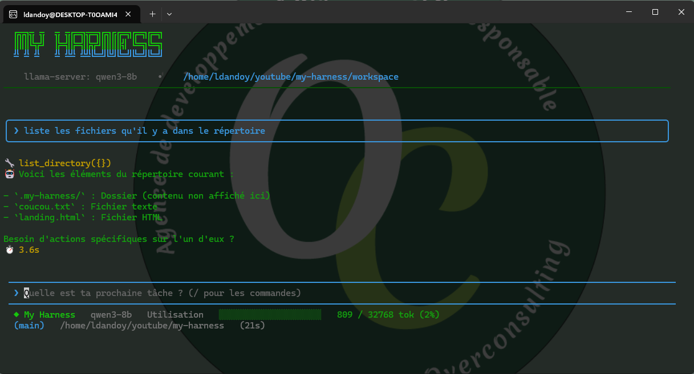

<div align="center">
  
</div>

<div align="center">


</div>

> Un harness agentique TypeScript minimaliste construit sur Ollama.  

## Prérequis

- **Node.js ≥ 24** → [nodejs.org](https://nodejs.org)
- **Ollama** installé et en marche → [ollama.ai](https://ollama.ai)
- Un modèle local : `ollama pull qwen2.5`

## Installation et utilisation

`my-harness` est une interface interactive (TUI), pas une commande one-shot : lancez-la, puis
discutez avec l'agent directement dans le terminal. Le seul argument attendu est le **workspace**
— le dossier dans lequel l'agent va lire/écrire des fichiers et exécuter des commandes.

- `.` → utilise le dossier courant comme workspace
- absent → crée (ou réutilise) un dossier `workspace/` dans le répertoire courant

Le plus simple : pas d'installation, `npx` télécharge et lance le CLI à la volée.

```bash
npx @overconsulting/my-harness .
```

### Installation globale

Pour avoir la commande `my-harness` directement disponible dans le terminal :

```bash
npm install -g @overconsulting/my-harness

my-harness .
```

### Depuis les sources (contribuer au projet)

```bash
git clone https://github.com/ldandoy/my-harness.git
cd my-harness
npm install
npm run dev .
```

## Screenshot

<div align="center">
  
</div>


## Outils disponibles

- `list_directory` Liste un dossier du workspace
- `read_file` Lit un fichier du workspace
- `write_file` Écrit un fichier du workspace (affiche un diff avant d'écrire)
- `run_command` Exécute une commande shell (liste blanche + confirmation), avec un mode `background` pour les process qui ne se terminent pas seuls (serveur de dev, watcher…)
- `ask_user` Pose une question à l'utilisateur en cours de tâche et attend sa réponse avant de continuer

## Commandes disponibles

Tapez `/` dans l'invite pour l'auto-complétion.

- `/models` Choisir le modèle du serveur actif
- `/connect <nom|url>` Changer de serveur LLM
- `/init` Analyser le projet et générer MYHARNESS.md
- `/clear` Réinitialiser le contexte de la session
- `/diff <id>` Voir le diff d'une écriture de fichier (le dernier par défaut)
- `/save` Sauvegarder la session en cours
- `/save-clear` Sauvegarder puis réinitialiser la session
- `/resume <id>` Lister ou reprendre une session sauvegardée
- `/planifier <fichier>` Découper une issue en sous-agents
- `/remember <texte>` Mémoriser une information
- `/exit` Quitter my-harness

## .harness/settings.json

`.harness/settings.json` stocke tes permissions de commandes entre les sessions.
Créé automatiquement au premier « Toujours autoriser », ou manuellement.

> **À ajouter dans `.gitignore`** : les permissions sont propres à chaque dev.

## Roadmap

- [x] Commandes autorisées dans un fichier JSON externe
- [x] Restructurer `src/tools/` — `registry.ts` au niveau `src/`
- [x] Restructurer les `types`dans un répertoire
- [x] Ajouter une interface graphique avec Ink
- [x] Streaming des réponses du modèle
- [x] Percister le choix du model
- [x] lorsqu'on tape / démarrer l'auto complétion sur les commandes
- [x] Modification de l'appel à l'API, pour être compatible openAI v1
- [x] Ajouter une mémoire de session au niveau du harness, pour que le llm ce souviennt de ce qu'on a dit avant
- [x] Refondre l'UI de l'app
- [x] Modifier les infos de le status bar (branch GIt)
- [x] Pouvoir lancer un server en background et pouvoir kill la tache.
- [x] Lors du write afficher le diff pour valider avant l'écriture
- [x] Ajouter le ask user, pour voir des infos voir des précisions de la par du user
- [x] Ajouter des sessions persistantes et un système de reprise de la session

## Licence

[MIT](LICENSE) © 2026 Overconsulting